# HDFS 기초
### 기존 분산 파일 시스템  
|대용량 파일 시스템|특징|
|:---:|:----:|
|DAS(Direct-Attached-Storage)|서버에 직접 연결된 스토리지이며, 외장형 하드디스크. 여러 개의 하드디스크를 장착할 수 있는 외장 케이스를 이용하는 방식
|NAS(Network-Attached Storate)|일종의 파일 서버. 별도의 운영체제를 사용하며, 파일 시스템을 안정적으로 공유할 수 있다. 주로 첨부파일이나 이미지 같은 데이터를 저장하는 데 많이 사용한다. 
|SAN(Storage Area Network)|수샙에서 수백 대의 SAN 스토리지를 데이터 서버에 연결해 총괄적으로 관리해주는 네트워크를 의미한다. DAS의 단점을 극복하기 위해 개발됐으며, 현재 SAN 기법이 시장의 절반 이상을 차지한다. DBMS와 같이 안정적이고 빠른 접근이 필요한 데이터를 저장하는 데 사용한다. 

HDFS와 기존 대용량 파일 시스템의 가장 큰 차이점은 저사양 서버를 이용해 스토리지를 구현할 수 있다는 점이다. 
기존 대용량 파일 시스템이 데이터 서버를 구성하려면 고성능 서버를 준비해야하며, 상당히 많은 비용이 발생한다.  
그러나 HDFS를 사용하면 많은 개수의 웹서버를 묶어서 하나의 스토리지처럼 사용할 수 있다. 

HDFS에 저장하는 데이터는 물리적으로는 분산된 서버의 로컬 디스크에 저장돼 있지만, 파일의 읽기 및 저장과 같은 제어는 HDFS에서 제공하는 API를 이용해 처리된다. 

HDFS가 적합하지 않은 경우 & 적합한 경우 
- DBMS와 같이 고성능과 고가용성이 필요한 경우에는 SAN 이용
- 안정적인 파일 저장이 필요한 경우 NAS 사용
- 전자상거래처럼 트랜잭션이 중요한 경우는 HDFS가 적합하지 않음
- 대규모 데이터를 저장하거나 배치로 처리를 하는 경우에 HDFS를 사용하면 됨

<br>
<hr>

HDFS 설계된 4가지 목표  
1. 장애 복구
    - HDFS는 장애를 빠른 시간에 감지하고, 대처 가능하다.
    - 데이터가 복제되어 저장되어 데이터 유실 방지할 수 있다. 
    - 분산 서버 간에는 주기적으로 상태를 체크해 빠른 시간에 장애를 인지하고 대처할 수 있게 도와준다.
2. 스트리밍 방식의 데이터 접근
    - HDFS의 목표는 클라이언트의 요청을 빠른 시간 내에 처리하는 것보다 동일한 시간 내에 더 많은 데이터를 처리하는 것을 목표로 한다.
    - 랜덤 접근 방식 대신 스트리밍 방식으로 데이터에 접근하도록 설계돼 있어서 끊임 없이 연속된 흐름으로 데이터에 접근할 수 있다. 
3. 대용량 데이터 저장
    - HDFS는 하나의 파일이 기가바이트에서 테라바이트 이상의 크기로 저장될 수 있도록 설계됐다.
    - 높은 데이터 전송 대역폭과 하나의 클러스터에서 수백 대의 노드르 지원할 수 있다. 
4. 데이터 무결성
    - HDFS에서는 한 번 저장한 데이터는 더이상 수정할 수 없고, 읽기만 가능하게 해서 데이터 무결성을 유지한다. 
    - 데이터 수정은 불가능하지만 파일 이동, 삭제, 복사할 수 있는 인터페이스를 제공한다. 
    - 현재 출시된 하둡 2.0 알파 버전부터는 HDFS에 저장된 파일에 append가 가능하다.

<br>
<br>
<hr>

# HDFS 아키텍처
## 블록 구조 파일 시스템  
HDFS는 <span style="background-color:lightyellow;">블록 구조</span>의 파일 시스템이다.  
블록 크기는 기본적으로 64MB 이다. 

블록 크기가 64MB 인 이유
1. 디스크 시크 타임 감소 (seek time 감소)
    > 디스크 탐색 시간  
    &emsp;&emsp; = seek time(디스크 위치 찾는 시간)   
    &emsp;&emsp;&emsp;+ search time (원하는 데이터 섹터에 도달하는 데 걸리는 시간)
    - 하둡 개발 시기의 디스크 전송 대역폭은 100MB/s 였기 때문에 시크 타임이 디스크 전송 대역폭의 1%만 사용하는 데 주안점을 두어 100MB에 근접한 64MB를 사용함
        - 참고로 하둡 2.0부터는 기본 블록 크기 128MB로 증가
2. 네임노드가 유지하는 메타데이터 크기 감소
    - 네임노드: 블록 위치, 파일명, 디렉터리 구조, 권한 정보 등 메탇데이터 정보를 메모리에 저장/관리
    - 블록의 크기가 크면 많은 양의 데이터를 저장해도 메타데이터는 그리 많지 않음
3. 클라이언트와 네임노드의 통신 감소
    - 클라이언트가 HDFS에 저장된 파일을 접근할 때 네임노드에서 해당 파일을 구성하는 블록의 위치를 조회함
    - 클라이언트는 스트리밍 방식으로 데이터를 읽고 쓰기 때문에 특별한 경우를 제외하고는 네임노드와 통신할 필요가 없어짐

HDFS는 기본적으로 블록을 저장할 때 3개씩 블록의 복제본을 저장한다.   
*-> 오류에 대비가 가능하다*

64MB의 기본 크기보다 작은 파일도 무조건 64MB의 블록을 차지하는 것이 아니라 크기에 맞게 블록이 저장된다.

<br> 

## 네임노드와 데이터 노드
HDFS: **마스터-슬레이브(master-slave)** 아키텍처  
마스터 서버: 네임 노드  
슬레이브 서버: 데이터 노드  

클라이언트 -> 네임노드: 파일 제어 요청  
네임노드 -> 데이터노드: 데이터노드 상태 모니터링  
데이터노드 -> 네임노드: 하트비트 전송  
보조 네임노드 -> 네임노드: 체크포인트  
클라이언트 -> 데이터노드: 파일 읽기/쓰기 요청  
데이터노드 -> 클라이언트: 파일 읽기/쓰기 응답  

### 네임노드
HDFS의 마스터 서버인 네임 너도는 다음과 같은 기능을 수행한다. 
- 메타 데이터 관리
    - 메타데이터
        - 파일 시스템 이미지(파일명, 디렉터리, 크기, 권한 등)와 파일에 대한 블록 매핑 정보로 구성
- 데이터 노드 모니터링
    - 데이터노드는 네임노드에게 3초마다 하트비트 메시지를 전송함
    - 하트비트 구성
        - 데이터노드 상태 정보
        - 데이터 노드에 저장돼 있는 블록의 목록(block report)
    - 하트비트를 이용해 데이터노드의 실행 상태와 용량을 모니터링 
    - 일정기간 하트비트를 전송하지 않는 데이터노드가 있을 경우 장애가 발생한 서버로 간주  
- 블록 관리
    - 장애 발생한 데이터노드-> 해당 데이터노드의 블록을 새로운 데이터노드로 복제
    - 용량 부족 데이터노드-> 여유 있는 데이터 노드로 블록 이동
    - 블록 복제본 수 관리
    - 복제본 수와 일치하지 않는 블록 발견 시 추가로 블록을 복제하거나 삭제
- 클라이언트 요청 접수
    - 클라이언트가 HDFS에 접근하려면 반드시 네임노드 접속이 선행됨
    - 조회의 경우 블록의 위치 정보 반환

### 데이터 노드
클라이언트가 HDFS에 저장하는 파일을 로컬 디스크에 유지함  
로컬 디스크에 저장되는 파일 종류는 2가지
1. 실제 데이터가 저장돼있는 로우 데이터
2. 체크섬이나 파일 생성 일자와 같은 메타데이터가 설정돼 있는 파일

<br>

## HDFS의 파일 저장
파일 저장 단계
1. 클라이언트가 네임노드에게 파일 저장을 요청하는 단계
    - 파일 저장을 위한 스트림 생성
2. 클라이언트가 데이터 노드에게 패킷을 전송하는 단계
    - 저장할 파일을 패킷 단위로 나눠서 각 데이터 노드에 전송
3. 클라이언트가 파일 저장을 완료하는 단계
    - 스트림을 닫고 파일 저장을 완료

<br>

## HDFS의 파일 읽기
저장된 파일을 조회하는 과정
1. 파일 조회 요청
    - 입력 스트림 객체를 이용해 저장된 파일 조회 가능
2. 블록 조회
    - 데이터 노드와 클라이언트가 같은 서버에 있는지 아닌지에 따라 다른 블록 리더기를 생성해 수행
3. 입력 스트림 닫기

<br>

## 보조 네임 노드
네임노드는 메타데이터를 메모리에서 처리하는데, 메모리에만 데이터를 유지할 경우 서버가 재부팅될 경우 모든 메타 데이터가 유실될 수 있다.  
HDFS는 이러한 문제점을 극복하기 위해 editslog와 fsimage라는 두 개의 파일을 생성한다. 

**editslog**: HDFS의 모든 변경 이력을 저장한다. (저장, 삭제, 이동 등)   
**fsimage**: 메모리에 저장된 메타데이터의 파일 시스템 이미지를 저장한 파일이다. 

네임노드 구동 후에 두 파일은 아래와 같이 사용된다. 
1. 네임노드 구동 시에 로컬에 저장된 fsimage, editslog를 조회
2. 메모리에 fsimage를 로딩해 파일 시스템 이미지를 생성
3. 메모리에 로딩된 파일 시스템 이미지에 editslog에 기록된 변경 이력을 적용
4. 메모리에 로딩된 파일 시스템 이미지를 이용해 fsimage 파일을 갱신
5. editslog를 초기화
6. 데이터노드가 전송한 블록 리포트를 메모리에 로딩된 파일시스템 이미지에 적용

editslog는 제한 없이 크기가 계속 커질 수 있기 때문에 크기가 너무 커진 경우 3번 단계를 진행하는 데 시간이 오래 걸릴 것이다.  
이런 문제점 해결을 위해 HDFS는 보조네임노드라는 노드를 제공한다.  

**보조네임노드의 역할**
- 주기적으로 네임노드의 fsimage를 갱신 = '체크포인트'라는 작업
- 보조네임노드 = 체크포인팅 서버
- **체크포인팅 단계**
    1. 보조네임노드는 네임노드에게 editslog를 롤링할 것을 요청한다.
        - 로그 롤링: 현재 로그 파일의 이름을 변경하고, 원래 이름으로 새 로그 파일을 만드는 것
    2. 네임노드는 기존 editslog를 롤링한 후, editslog.new를 생성
    3. 보조네임노드는 네임노드에 롤링된 editslog와 fsimage를 다운로드
    4. 보조네임노드는 다운받은 fsimage를 메모리에 로딩하고, editslog에 있는 변경 이력을 메모리에 로딩된 파일 시스템 이미지에 적용.  
    메모리 갱신이 완료되면  새로운 fsimage를 생성하며, 이 파일을 체크포인팅할 때 사용. (이 때 파일명은 fsimage.ckpt)
    5. 보조네임노드는 fsimage.ckpt를 네임노드에게 전송
    6. 네임노드는 로컬에 저장돼 있던 fsimage를 보조네임노드가 전송한 fsimage.ckpt로 변경. 그리고 editslog.new 파일명을 editslog로 변경
- 보조네임노드가 fsimage와 editslog를 다운받아 editslog를 반영한 새로운 fsimage를 생성해 다시 네임노드로 보내면 네임노드는 fsimage를 새 것으로 갈고, editslog의 크기를 축소하는 것!

**보조 네임노드는 네임노드의 fsimage를 축소시켜주는 역할을 담당할 뿐 백업 서버가 아니다**
```  
-> 보조 네임 노드가 다운돼 있더라도 네임노드가 동작하는 데는 문제가 없음  
그러나 네임노드 재구동시 editslog 크기가 너무 커 네임노드 메모리에 로딩되지 못하는 경우가 생길 수 있으므로 보조 네임노드의 상태와 editslog 용량을 계속 확인해주어야 함. 
```


<hr>

# HDFS 명령어
hdfs를 제어할 수 있는 셸 명령어 = FileSystemShell (fs 셸)  

fs shell 실행 방법  
```shell
./bin/hadoop fs -cmd [args]
```
- cmd: 사용자가 설정한 명령어
- args: 해당 명령어르ㅡㄹ 실행할 때 필요한 파라미터

### 어떤 명령어가 제공되는 지 확인
```shell
hadoop fs -help
```

fs shell: 파일에 대한 권한 부여, 파일의 복사 및 삭제와 같은 일반적인 파일에 대한 작업을 대부분 지원하며, 파일의 복제 정보에 대한 변경과 같은 HDFS의 특정 작업도 지원한다. 

> 설정 환경상 도커 컨테이너 내의 홈 디렉터리 != 하둡 홈 디렉터리 이기 때문에 명령어를 ./bin/hadoop이 아닌 $HADOOP_HOME/bin/hadoop 으로 진행했다.   

<br> 
<hr/>

## 파일 목록 보기 - ls, lsr
### <span style="background: lightyellow;">ls</span>
지정한 디렉터리에 있는 파일의 정보를 출력 or 특정한 파일을 지정해 정보를 출력
```shell
./bin/hadoop fs -ls [디렉터리|파일...]
```

사용 예
1. 경로 미지정시 홈 디렉터리를 조회
2. 디렉터리를 지정할 경우 해당 디렉터리에 저장돼 있는 파일 목록을 출력


> 미리 "$HADOOP_HOME/bin/hadoop sample / "명령어로 샘플 파일을 생성 후 경로에 넣어두었다. 

### <span style="background: lightyellow;">lsr</span>
현재 디렉터리의 하위 디렉터리 정보까지 출력한다. (-lsr은 deprecated. -ls -R 이용하기)
```shell
./bin/hadoop fs -ls -R [디렉터리|파일...]
```
사용 예  
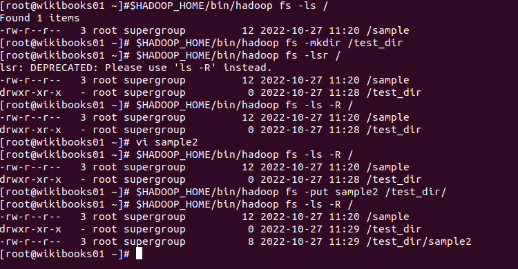

-mkdir 명렁을 통해 미리 폴더를 만들어두고 예시 파일을 그 아래 위치시킨 후 lsr 명령을 한 상황이다. 

<br>
<hr/>

## 파일 용랑 확인 - du, dus
### <span style="background: lightyellow;">du</span>
지정한 디렉터리나 파일의 사용량을 확인하는 명령어로 바이트 단위로 결과를 출력한다.  
(-dus는 deprecated. -du -s 를 대신 쓰기)  
```shell
./bin/hadoop fs -du [디렉터리|파일...]
```

사용 예

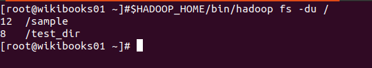

### <span style="background: lightyellow;">dus</span>
전체 합계 용량만 출력
```shell
./bin/hadoop fs -dus [디렉터리|파일...]
```

사용 예  


<br>
<hr/>

## 파일 내용 보기 - cat, text
### <span style="background: lightyellow;">cat</span>
지정한 파일의 내용을 화면에 출력한다.  
텍스트 파일만 출력 가능하다. 

```shell
./bin/hadoop fs -cat [파일...]
```

사용 예  
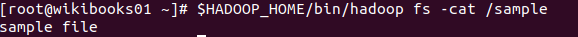

### <span style="background: lightyellow;">text</span>
zip 파일 형태로 압축된 파일도 텍스트 형태로 화면에 출력한다. 

```shell
./bin/hadoop fs -text [파일...]
```

사용 예  
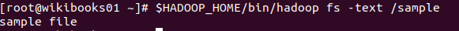

<br>
<hr/>

## 디렉터리 생성 - mkdir
### <span style="background: lightyellow;">mkdir</span>
지정한 경로에 디렉터리를 생성한다.  
이미 존재하는 디렉터리를 생성할 경우 오류가 발생한다.  
```shell
./bin/hadoop fs -mkdir [디렉터리]
```

사용 예  
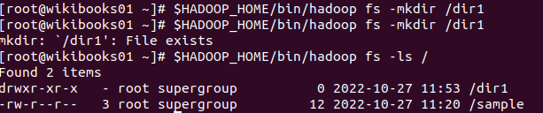

<br>
<hr/>

## 파일 복사 - put, get, getmerge, cp, copyFromLocal, copyToLocal
### <span style="background: lightyellow;">put</span>  
지정한 경로에 로컬 파일 시스템의 파일 및 디렉터리를 목적지 경로로 복사한다. 
```shell
./bin/hadoop fs -put [로컬 디렉터리|파일...] [목적지 디렉터리|파일]
```

사용 예  
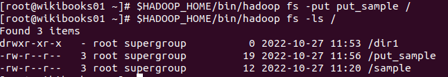  

로컬에 있는 파일 여러개를 put 하는 것도 가능하다.  
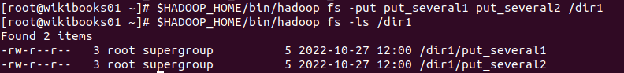  

타깃 디렉터리가 기존에 없는 경우는 새로 생성하고 파일을 옮겨 넣는다. 

### <span style="background: lightyellow;">copyFromLocal</span>
put 명령어와 동일한 기능을 제공한다. 
```shell
./bin/hadoop fs -copyFromLocal [로컬 디렉터리|파일...] [목적지 디렉터리|파일]
```

### <span style="background: lightyellow;">get</span>
HDFS 저장된 데이터를 로컬 파일 시스템으로 복사한다.  
파일 무결성을 위하 HDFS는 체크섬 기능을 사용하는데, -crc옵션을 사용하면 로컬 파일 시스템에 체크섬 파일도 복사된다.  
-ignoreCrc 옵션을 사용하면 해당 파일의 체크섬을 확인하지 않는다. 
```shell
./bin/hadoop fs -get <-ignoreCrc> <-crc> [소스 디렉터리|파일...] [로컬 디렉터리|파일]
```

사용예  
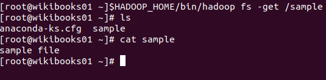

### <span style="background: lightyellow;">getmerge</span>
지정한 경로에 있는 모든 파일의 내용을 합친 후, 로컬 파일 시스템에 단 하나의 파일로 복사한다.  
```shell
./bin/hadoop fs -getmerge [소스 디렉터리|파일...] [로컬 디렉터리|파일]
```

사용예  
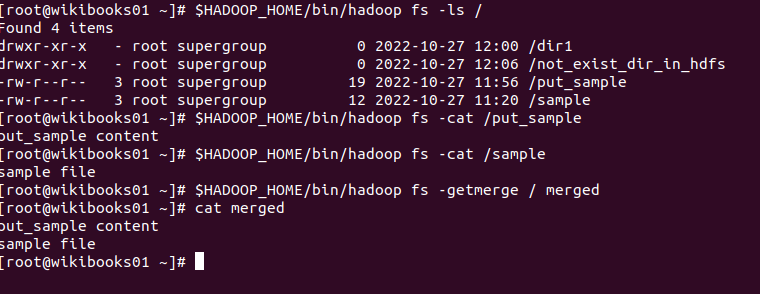

### <span style="background: lightyellow;">cp</span>
지정한 소스 디렉터리 및 파일을 목적지 경로로 복사하는 기능을 제공한다.  
여러 개의 파일을 복사할 경우 반드시 디렉터리로 복사되도록 설정한다.
```shell
./bin/hadoop fs -cp [소스 디렉터리|파일...] [로컬 디렉터리|파일]
```

사용예  
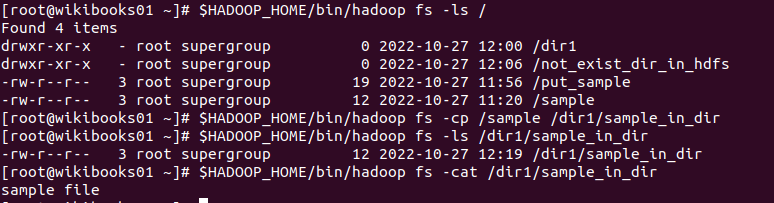

### <span style="background: lightyellow;">cpToLocal</span>
get 명령어와 동일한 기능을 제공한다 
```shell
./bin/hadoop fs -cp [소스 디렉터리|파일...] [로컬 디렉터리|파일]
```
<br>
<hr/>

## 파일 이동 - mv, moveFromLocal
### <span style="background: lightyellow;">mv</span>  
소스 디렉터리 및 파일을 목적지 경로로 옮긴다.  
여러 개 파일을 이동할 경우 반드시 목적지 경로를 디렉터리로 해야한다. 
```shell
./bin/hadoop fs -mv [소스 디렉터리|파일...] [목적지 디렉터리|파일]
```

사용 예  
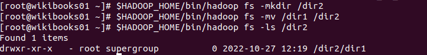

### <span style="background: lightyellow;">moveFromLocal</span>  
put 명령어와 동일하게 동작하지만 로컬 파일 시스템으로 파일이 복사된 후 소스 경로의 파일은 삭제된다 
```shell
./bin/hadoop fs -moveFromLocal [소스 디렉터리|파일...] [목적지 디렉터리|파일]
```

<br>
<hr/>

## 파일 삭제 - rm
### <span style="background: lightyellow;">rm</span>  
지정한 디렉터리나 파일을 삭제할 수 있다.  
디렉터리는 비어있는 경우에만 삭제할 수 있다.  
```shell
./bin/hadoop fs -rm [디렉터리|파일...]
```

사용 예  
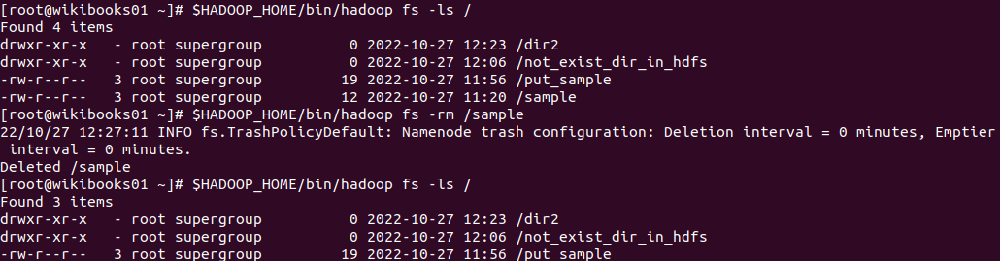

**비어있지 않은 디렉터리를 삭제하고 싶다면 -rm 대신 -rmr을 사용하면 된다**

<br>
<hr/>

## 카운트 값 조회 - count
### <span style="background: lightyellow;">count</span>  
지정한 경로에 대한 전체 디렉터리 개수, 전체 파일 개수, 전체 파일 크기, 지정한 경로명을 출력한다  
-q 옵션 사용 시에 디렉터리에서 생성할 수 있는 파일 개수나 용량의 제한값을 확인할 수 있다.  
```shell
./bin/hadoop fs -count <-q> [디렉터리|파일...]
```

사용 예  
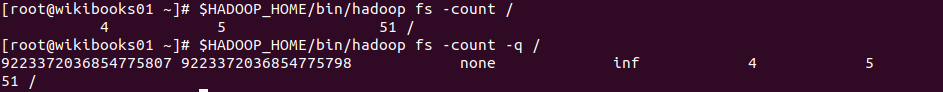

<br>
<hr/>

## 파일의 마지막 내용 확인 - tail
### <span style="background: lightyellow;">tail</span>  
지정한 파일의 마지막 1KB에 해당하는 내용을 화면에 출력한다.   
-f 옵션을 사용하면 해당 파일에 내용이 추가될 때 화면에 출력된 내용도 함께 갱신된다.  
```shell
./bin/hadoop fs -tail [파일]
```

사용 예  


<br>
<hr/>

## 권한 변경 - chmod, chown, chgrp
### <span style="background: lightyellow;">chmod</span>  
지정한 경로에 대한 권한을 변경한다.  
권한 변경은 chmod 명령어를 실행하는 사용자가 해당 파일의 소유자이거나, 슈퍼 유저일 때만 가능하다.  
명령을 재귀적으로 실행하고 싶으면 -R 옵션을 준다. 
```shell
./bin/hadoop fs -chmod <-R>  [권한모드...] [디렉터리|파일...]
```

사용 예  
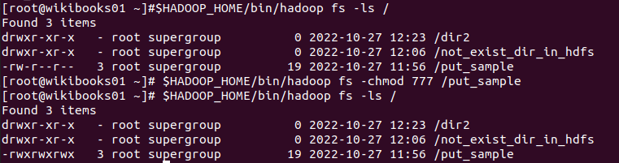

### <span style="background: lightyellow;">chown</span>  
지정한 경로에 대한 소유권을 변경하는 명령어이다.  
명령을 재귀적으로 실행하고 싶으면 -R 옵션을 준다. 
```shell
./bin/hadoop fs -chown <-R>  [변경사용자명:변경그룹명] [디렉터리|파일...]
```

사용 예  
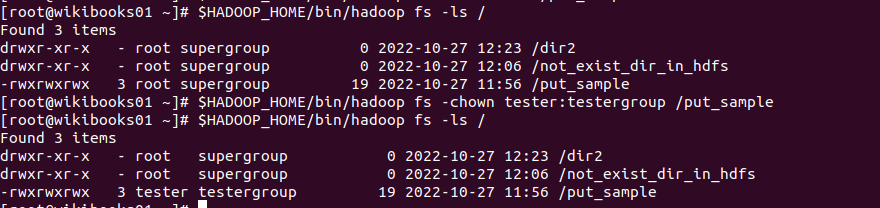

### <span style="background: lightyellow;">chgrp</span>  
지정한 경로에 대한 소유권 그룹만 변경하는 명령어이다.  
명령을 재귀적으로 실행하고 싶으면 -R 옵션을 준다. 
```shell
./bin/hadoop fs -chown <-R>  [변경사용자명:변경그룹명] [디렉터리|파일...]
```

사용 예  
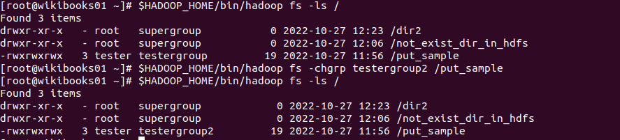

<br>
<hr/>

## 0바이트 파일 생성 - touchz
### <span style="background: lightyellow;">touchz</span>  
크기가 0바이트인 파일을 생성한다.  
지정한 파일 명이 이미 0바이트 이상인 상태로 저장돼 있다면 오류가 발생한다. 
```shell
./bin/hadoop fs -touchz [파일...]
```

사용 예  
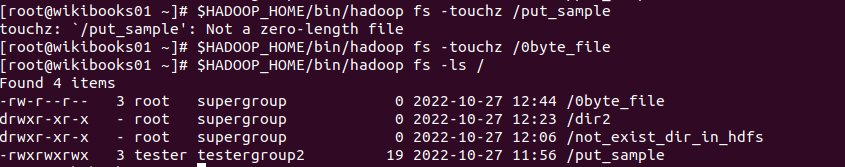

<br>
<hr/>

## 통계 정보 조회 - stat
### <span style="background: lightyellow;">stat</span>  
지정한 경로에 대한 통계 정보를 조회한다.  
사용 가능한 출력 포맷 옵션
- %b
- %F
- %n  
- %o
- %r
- %y 
- %Y
```shell
./bin/hadoop fs -stat <출력 포맷> [디렉터리|파일...]
```

사용 예  
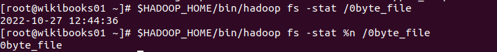


<br>
<hr/>

## 복제 데이터 개수 변경 - setrep
### <span style="background: lightyellow;">setrep</span>  
설정한 파일의 복제 데이터 개수를 변경한다
명령을 재귀적으로 실행하고 싶으면 -R 옵션을 준다. 

```shell
./bin/hadoop fs -setrep <-R> -w [복제 데이터 개수] [디렉터리|파일...]
```

사용 예  
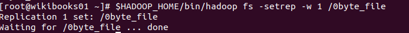

## 휴지통 비우기 - expunge
### <span style="background: lightyellow;">expunge</span>  
휴지통을 비운다  
HDFS의 휴지통 = .Trash/라는 임시 디렉터리 (시간이 지나야 완전히 삭제함)

```shell
./bin/hadoop fs -expunge
```

사용 예  
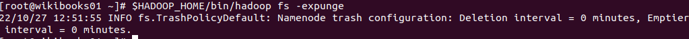

<br>
<hr/>

## 파일 형식 확인 - test
### <span style="background: lightyellow;">test</span>  
지정한 경로에 대해 [-ezd] 옵션으로 경로가 이미 존재하는지, 파일 크기가 0인지, 디렉터리인지 확인한다.  
체크 결과가 맞을 경우 0을 출력한다.
```shell
./bin/hadoop fs -test -[defsz] [디렉터리|파일]
```